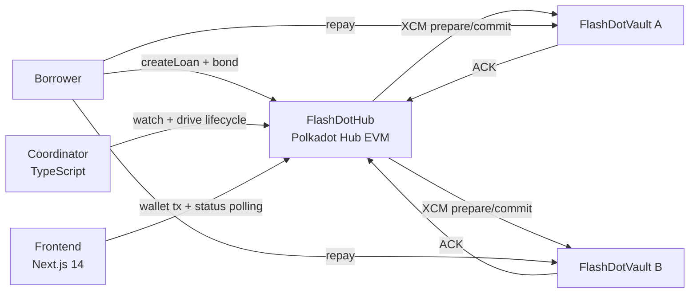

<p align="center">
  
</p>

# FlashDot ⚡

Bonded cross-chain flash loan aggregator on Polkadot Hub.

FlashDot uses **economic atomicity**: lenders are guaranteed `principal + interest` either by borrower repayment or by hub-side bond slashing.

## Hackathon Track Fit

- Track 1 (EVM Smart Contracts): `FlashDotHub.sol`, `FlashDotVault.sol`
- Track 2 (PVM/XCM Precompiles): Hub-side `xcmTransact` integration + ACK callback state machine

## Demo Video

- Recording runbook: [docs/demo-script.md](./docs/demo-script.md)
- Replace this section with the final Loom or YouTube URL before submission.

## Architecture (Mermaid)



상세 다이어그램은 [docs/architecture.md](./docs/architecture.md) 참조.

## Repository Structure

```text
flashdot-monorepo/
├── contracts/      # Solidity contracts + hardhat/foundry tests
├── coordinator/    # TS service (watcher/retry/timeout/health)
├── frontend/       # Next.js app (wallet + create loan + status)
├── zombienet/      # local multi-chain network scripts/config
├── docs/           # configuration + architecture docs
├── PROJECT.md
├── TICKET.md
└── DONE_TICKET.md
```

## Quick Start (5 Steps)

### 1. Install dependencies

```bash
pnpm install
```

### 2. Run smart contract tests

```bash
pnpm -C contracts test
pnpm -C contracts test:forge
```

### 3. Prepare coordinator config + DB

```bash
cp coordinator/.env.example coordinator/.env
pnpm -C coordinator exec drizzle-kit migrate
pnpm -C coordinator build
```

### 4. Start coordinator

```bash
pnpm -C coordinator start
# health: http://127.0.0.1:8787/health
```

### 5. Start frontend

```bash
cp frontend/.env.example frontend/.env.local
# or generate local addresses from Zombienet deployments:
# node zombienet/scripts/export-frontend-env.mjs
pnpm -C frontend dev
# http://localhost:3000
```

## Local Testnet / E2E (Optional)

```bash
zombienet spawn zombienet/config.toml
pnpm -C contracts test
```

`contracts/test/e2e/scenarios/`에 시나리오 테스트 파일이 정리되어 있습니다.

- `01-happy-path.test.ts`
- `02-prepare-failure.test.ts`
- `03-partial-commit.test.ts`
- `04-default.test.ts`
- `05-delayed-ack.test.ts`

## Contract Addresses

- Local / test deployments are environment-driven.
- See [docs/configuration.md](./docs/configuration.md) for required variables.

## Protocol Invariant Summary

- I-1: committed lender never loses principal+interest
- I-2: `CommittedAcked` is one-way
- I-3: vault endpoints are idempotent
- I-4: bond covers all repay obligations + fee budgets
- I-5: vault remote endpoints are Hub-origin-only
- I-6: commit is single execution per loan

검증 위치는 [SECURITY.md](./SECURITY.md) 참조.

## Security Highlights

- Reentrancy guards on Hub settlement/default and Vault state transitions
- Bond pre-lock before any XCM dispatch
- Access controls: `onlyOwner`, `onlyXcmExecutor`, `onlyHubOrigin`
- Pause controls for create/commit without blocking repay/default

## Configuration

- Environment variable reference: [docs/configuration.md](./docs/configuration.md)
- Architecture docs: [docs/architecture.md](./docs/architecture.md)

## License

MIT
