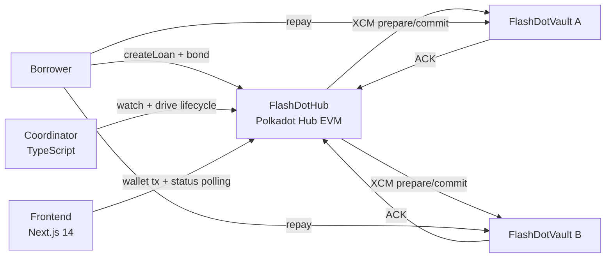

<p align="center">
  
</p>

# FlashDot ⚡

Bonded cross-chain flash loan aggregator on Polkadot Hub.

FlashDot uses **economic atomicity**: lenders are guaranteed `principal + interest` either by borrower repayment or by hub-side bond slashing.

## Hackathon Track Fit

| Track | Evidence |
|---|---|
| Track 1 — EVM Smart Contracts | `FlashDotHub.sol`, `FlashDotVault.sol` (Solidity 0.8.28 / Hardhat + Foundry) |
| Track 2 — PVM / XCM Precompiles | Hub-side `xcmTransact` integration + ACK callback state machine via `IXcmPrecompile` |

## Live Demo

| Component | URL |
|---|---|
| **Frontend** | <https://flashdot.vercel.app> |
| **Coordinator API** | <https://coordinator-production-1de8.up.railway.app/health> |
| **Block Explorer** | <https://blockscout-testnet.polkadot.io> |

> Recording runbook: [docs/demo-script.md](./docs/demo-script.md)
> Replace this line with the final Loom / YouTube URL before submission.

## Architecture



Details → [docs/architecture.md](./docs/architecture.md)

## Repository Structure

```text
flashdot-monorepo/
├── contracts/      # Solidity contracts + Hardhat/Foundry tests
├── coordinator/    # TS service — watcher / retry / timeout / health
├── frontend/       # Next.js 14 — wallet + create loan + status
├── zombienet/      # Local multi-chain testnet scripts
└── docs/           # Architecture, configuration, demo script
```

## Deployed Contracts (Polkadot Hub TestNet / Paseo)

| Contract | Address |
|---|---|
| MockToken (wDOT) | `0xEB0AAED452428a9bE0414A00B2F001400c176d9D` |
| FlashDotHub | `0x27DBBFCCd6471b2e473cf424bc81219330e7279a` |
| FlashDotVault A | `0xc2b3F70A4B4BDE43E2c110EEC60d5688608cb71E` |
| FlashDotVault B | `0x509747fc2c2BaD594be37aA39031B322eEb4f73c` |

Network: **Polkadot Hub TestNet** · Chain ID `420420417` · RPC `https://eth-rpc-testnet.polkadot.io`

## Quick Start

```bash
# 1. Install
pnpm install

# 2. Contract tests
pnpm -C contracts test          # Hardhat
pnpm -C contracts test:forge    # Foundry

# 3. Coordinator
cp coordinator/.env.example coordinator/.env
pnpm -C coordinator build
pnpm -C coordinator start       # health: http://127.0.0.1:8787/health

# 4. Frontend
cp frontend/.env.example frontend/.env.local
pnpm -C frontend dev            # http://localhost:3000
```

## Local Testnet / E2E (Optional)

```bash
zombienet spawn zombienet/config.toml
npx tsx zombienet/scripts/deploy.ts
pnpm -C contracts test:e2e
```

5 E2E scenarios in `contracts/test/e2e/scenarios/`:
`01-happy-path` · `02-prepare-failure` · `03-partial-commit` · `04-default` · `05-delayed-ack`

## Protocol Invariants

| ID | Rule |
|---|---|
| I-1 | Committed lender never loses principal + interest |
| I-2 | `CommittedAcked` is one-way (irreversible) |
| I-3 | Vault endpoints are idempotent |
| I-4 | Bond covers all repay obligations + fee budgets |
| I-5 | Vault remote endpoints are Hub-origin-only |
| I-6 | Commit is single-execution per loan |

Verification locations → [SECURITY.md](./SECURITY.md)

## Security Highlights

- Reentrancy guards on Hub settlement/default and Vault state transitions
- Bond pre-lock before any XCM dispatch
- Access controls: `onlyOwner`, `onlyXcmExecutor`, `onlyHubOrigin`
- Pause controls for create/commit without blocking repay/default

## Documentation

- [Architecture](./docs/architecture.md)
- [Configuration](./docs/configuration.md)
- [Demo Script](./docs/demo-script.md)
- [Security](./SECURITY.md)
- [Deployment Guide](./DEPLOY.md)

## License

MIT
