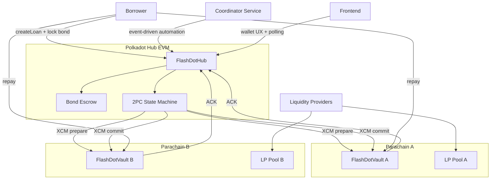

# Architecture

## High-level

## Lifecycle

1. Borrower locks bond on Hub.
2. Hub sends prepare XCM to each vault.
3. ACK success => commit phase.
4. Borrower repays committed legs.
5. Settle returns bond minus fees.
6. If expired unpaid => default triggers bond slash payout.

## Key Safety Properties

- Economic atomicity through pre-funded bond.
- Committed leg irreversibility.
- Idempotent vault endpoints for duplicated/reordered cross-chain calls.
